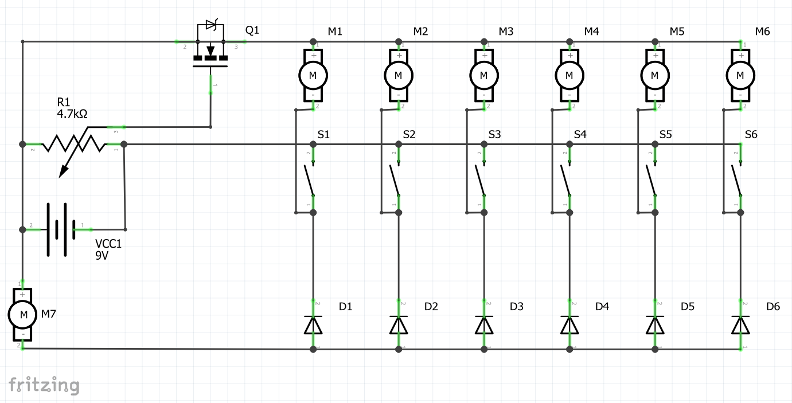
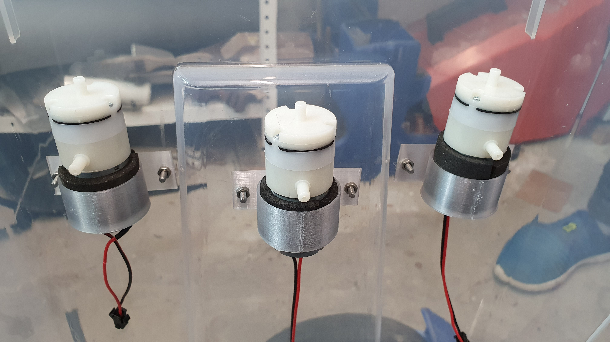
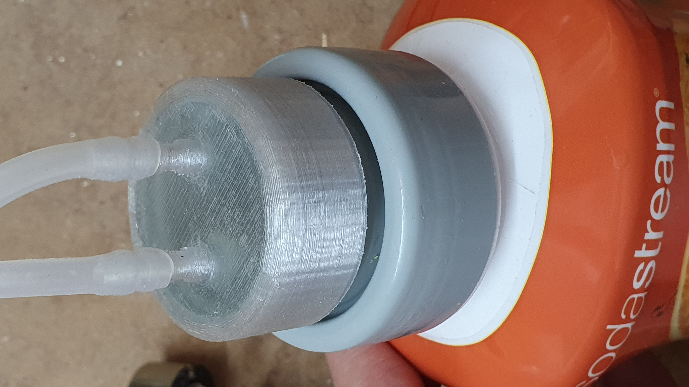
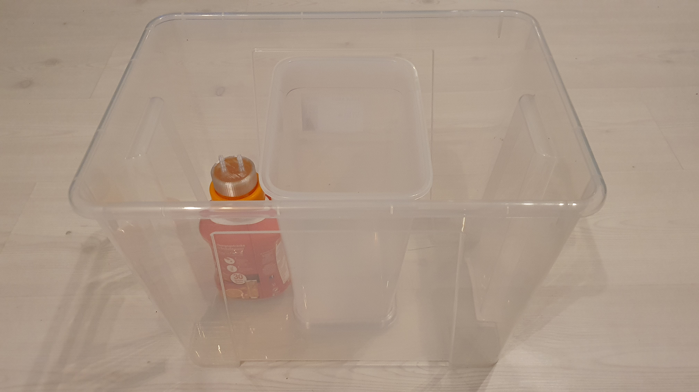
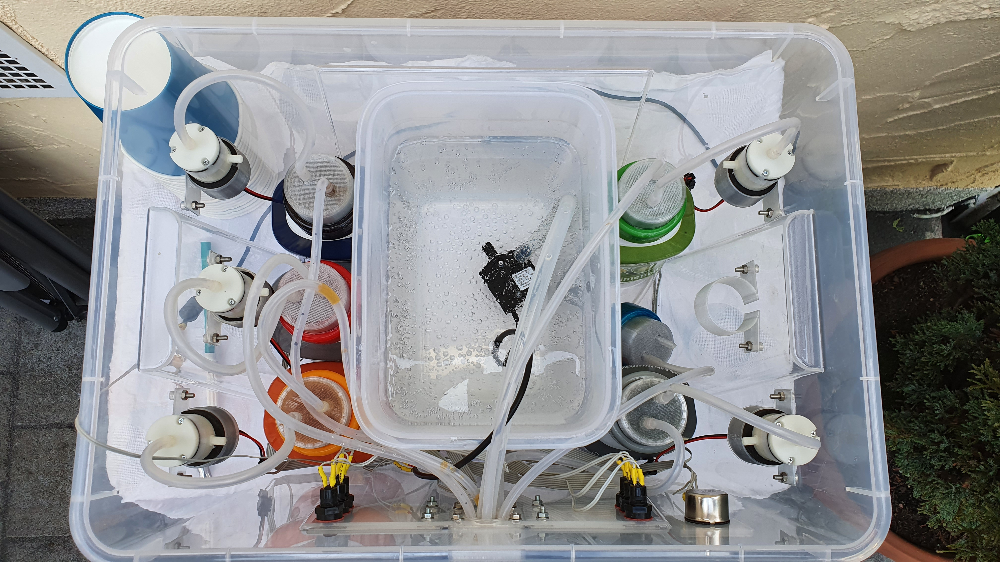

# SodaMat - der freie DIY Getränkeautomat zum Bezug von Mischgetränken aus Wasser und Sodastream Sirup 

 

SodaMat ist ein selbst gebauter Geträkemischautomat, der sowohl aus 3D gedruckten Teilen als auch aus leicht verfügbaren Komponenten besteht.

Ziel des Projektes ist es, eine Maschine zu bauen, die auf Knopfdruck die gewünschte Menge eines im richtigen Verhältnis fertig gemischten Getränks aus aufgesprudeltem Wasser und Sirup zubereitet.

Wir stellen unser Design des Getränkeautomats unter Open Source und beschreiben hier den Aufbau, so dass ihn einjeder für nicht-kommerzieller Zwecke Lizenzkostenfrei nachbauen kann. 

## Videos

__Schaltung__

In diesem Video zeige ich kurz die Funktionsweise der Schaltung auf einem Breadboard.

https://youtu.be/glGSpBsMzlo

__Nach Einbau der Elektrischen Komponenten__

Dieses Video zeigt einen Zwischenstand beim Aufbau des Getränkeautomats, als die elektrischen Komponenten wie Pumpen, Taster und das Potentiometer bereits fertig in das Gehäuse eingebaut wurden.

https://youtu.be/BnMTtF5-dhc

__Erster Funktionstest mit echtem Sirup__

Dieses Video zeigt den ersten Funktionstest des Automaten nach Einbau und Anschluss aller Komponenten.

https://youtu.be/NOZfXYWacTg

## Features

- Besitzt einen 4,2 Liter Vorratsbehälter für pures, aufgesprudeltes Wasser
- Bietet ausreichend Platz für den Anschluss von bis zu 6 verschiedenen Sodastream Sirup-Behältern
- Mischverhältnis durch Drehzahlregelung der Sirup-Pumpen über Potentiometer variabel einstellbar
- Leicht nachzubauen, da ausschließlich 3D gedruckte Teile sowie leicht verfügbare, kostengünstige Kaufteile verwendet wurden 
  - Ikea Samla Kiste als Gehäuse
  - Ikea 365+ Behälter als Wasservorrat
  - Micro Luftpumpen als Sirup-Luftdruckpumpen
  - Aquariumpumpe als Wasserpumpe
  - Silikonschläuche
- Gute Hygiene / Lebensmittelverträglichkeit
  - Alle Lebensmittelberürenden Teile sind zertifiziert Lebensmittelecht
  - Sirup kommt nicht mit der Pumpe in Kontakt, da Pumpe nur Druckluft erzeugt und dadurch den Sirup über ein Steigrohr aus dem Behälter heraus verdrängt
  - Leicht zu reinigen, Wasserbehälter entnehmbar, alle Lebensmittelberürenden Komponenten können mit Seifenwasser durchgespühlt werden
- Leicht zu transportieren, alle Komponenten finden in der Kiste Platz
- Erweiterbare und leicht modifizierbare Plattform
  - Modulares Design erlaubt Austausch einzelner Komponenten z. B. 
  - Ersatz der Luftdruckpumpen durch Peristaltikpumpen möglich
  - Austausch der analogen Drehzahlregelung durch PMW über Microcontroller möglich
  - Wägzellen / Füllstandssensoren / Durchflusssensoren können nachgerüstet werden

## Benötigte Teile

- 1x Ikea Samla Box mit Deckel 22 Liter als Gehäuse
  - https://www.ikea.com/de/de/p/samla-box-mit-deckel-transparent-s79850875/
- 1x Ikea 365+ Vorratsbehälter mit Deckel 4,2 Liter als Wasservorratsbehälter (Deckel ist optional, erleichtert jedoch den Transport)
  - https://www.ikea.com/de/de/p/ikea-365-vorratsbehaelter-mit-deckel-rechteckig-kunststoff-s59276822/
- 1x DC Netzteil 9 Volt oder 12 Volt mindestens 1500 mA
- 1x Aquarium Tauchpumpe als Wasserpumpe mit mindestens 240 L/h Durchfluss
  - https://www.amazon.de/gp/product/B07R8SLQS7
- 6x Mini Luftpumpen 6 Volt als Sirup Druckluftpumpen
  - https://www.amazon.de/gp/product/B07BY4LP22
  - https://de.aliexpress.com/item/32852470081.html
- 6x Taster / Push Buttons für das Bedienfeld
  - https://de.aliexpress.com/item/4000164264475.html
- 1 Meter Silikonschlauch 7 x 10 mm für Wasserpumpe 
  - https://www.amazon.de/gp/product/B06XW5NYZ1
- 5 Meter Silikonschlauch 3 x 5 mm als Luftdruckschlauch und als Steigleitung für Sirup
  - https://www.amazon.de/gp/product/B01N2GW7PX
- 1x N-Kanal Mosfet zum Beispiel Infineon IRF740PBF oder Infineon IRFP064N oder Infineon IRFP1405PBF
  - https://de.aliexpress.com/item/32907153234.html
- 1x Potentiometer 4,7 kOhm 
  - https://www.amazon.de/gp/product/B07M5MB2M5
- 6x Diode 1 Ampere zum Beispiel 1N4007
  - https://www.amazon.de/gp/product/B07JGRXJQ5
- 1x Lochrasterplatine
  - https://www.amazon.de/gp/product/B078HV79XX
- 16x Zylinderschrauben M3 x 10 mm und Muttern (optional dazu U-Scheiben)
- Optional Madenschraube M5 zum Festklemmen der Potentiometer-Kappe
- 4x Sekkopfschrauben M3 x 10 mm und Muttern (optional dazu U-Scheiben) für Bedienfeld mit Getränke-Labels
- Optional JST-Stecker + Crimpzange zum Herstellen von Steckanschlüssen für die Pumpen
  - https://www.amazon.de/gp/product/B0716WZ6RW
- Optional 40 Pin IDE Header + IDE Flachbandkabel als Anschlusskabel aller elektrischen Bauteile an die Platine
  - https://www.amazon.de/gp/product/B007Q92OK2
  - https://www.amazon.de/gp/product/B00Z5AVRDY
  - So etwas lässt sich aber auch wunderbar aus einem alten PC-Mainboard ausschlachten
- Optional Litzenkabel 0,5 mm² (falls man sich gegen das IDE Flachbandkabel entscheidet)
- 1x Rolle 3D Drucker Filament aus zertifiziert lebensmittelechtem Material, Empfehlung BASF Ultrafuse EPR InnoPET in Transparent
  - https://www.igo3d.com/innofil3d-epr-pet
- 6x Verschlusskappen von Sodastream Sirup-Flaschen
- Kleber zum Verkleben von Kunststoffteilen
- Schrumpfschlauch
- Lötzinn
- Heißklebesticks
- Kabelbinder

## Werkzeuge

- 3D Drucker
- Lötkolben
- Heißklebepistole
- Multimeter
- Optional Breadboard / Steckplatine + Anschlusskabel zum Testen der Schaltung bevor man sie fest verlötet
- Cuttermesser
- Zangen (Abisolierzange, Schnabelzange)
- Optional Crimpzange für JST-Stecker
  - https://www.amazon.de/gp/product/B01N4L8QMW
- Pinzette
- Schraubenzieher / Schraubenschlüssel
- Filzstift zum Markieren auf Kunststoff
- Zollstock
- Lochkreisbohrer mit 24 mm Durchmesser
- Bohrer 3,5 mm und 10 mm
- Handsäge mit feiner Zahnung (für Kunststoff geeignet)
- Feilen / Schleifpapier

## Elektrische Schaltung

### Aufbau der Schaltung auf Steckplatine / Breadboard

 

### Schaltplan

 

### Stückliste

Nr.     | Anzahl | Bezeichnung  
------  | ------ | -------------
M1 - M6 | 6      | Mini Luftpumpen 6 Volt
S1 - S6 | 6      | Taster / Push Buttons
D1 - D6 | 6      | Diode 1 Ampere 1N4007
M7      | 1      | Aquarium Tauchpumpe mit mindestens 240 L/h Durchfluss
R1      | 1      | Potentiometer 4,7 kOhm
Q1      | 1      | N-Kanal Mosfet zum Beispiel Infineon IRF740PBF oder Infineon IRFP064N oder Infineon IRFP1405PBF
VCC1    | 1      | DC Netzteil 9 Volt oder 12 Volt mindestens 1500 mA

### Umsetzung

Optional kann die Schaltung zu Testzwecken zunächst auf einem Breadboard aufgebaut werden (siehe Aufbauskizze oben). Zur Vereinfachung kann auch zum Beispiel mit nur zwei Siruppumpen getestet werden, hierzu einfach M3-6, S3-6 und D3-6 weglassen.

Anschließend sind alle Komponenten wie im Schaltplan dargestellt auf eine Lochrasterplatine zu löten. Die Platine wird später unten in der Gehäusemitte zwischen der Gehäusefront und dem Wasserbehälter platziert, bei den Kabellängen also bitte daran denken.

Optional können die freihstehenden Bauteile, die nicht direkt auf der Platine aufgelötetet werden, über ein 40 Pin IDE-Header + Flachbandkabel steckbar an die Platine angebunden werden. Dies betrifft 

- die Pumpen M1 - M6 sowie M7
- die Taster S1 - S6
- das Potentiometer R1
- die Stromquelle / das Netzteil VCC1 

Hierzu ist einfach das 40 Pin IDE-Header auf die Platine anzulöten und sich eine Belegung auszudenken und zu notieren. Ich habe die Pins in Hinblick auf einen strategisch klugen Kalebweg (ohne wilde Überkreuzungen) wie folgt gewählt:

- Pin 1 - 6 für die Pumpen M1 - M3 auf der linken Gehäuseseite
- Pin 7 - 12 für die Taster S1 - S3 auf der linken Gehäuseseite
- Pin 26 - 28 für das Potentiometer R1 auf der rechten Gehäuseseite
- Pin 29 - 30 für die Stromquelle / das Netzteil VCC1
- Pin 31 - 32 für die Wasserpumpe M7 in der Mitte des Gehäuses
- Pin 29 - 34 für die Taster S4 - S6 auf der rechten Gehäuseseite
- Pin 35 - 40 für die Pumpen M4 - M6 auf der rechten Gehäuseseite

Ansonsten (falls man sich gegen die Verwendung eines IDE Headers entscheidet) sind die elektrischen Verbindungen über Litzenkabel auszuführen.

Alle Lötverbindungen an Kabel und Kontakte freistehender Bauteile sind mit Schrumpfschlauch vor Kurzschlüssen zu isolieren.

Optional können auf Seite der Pumpen JST-Stcker und Buchsen an die Kabel gecrimpt werden, um eine Pumpe zum Beispiel bei einem Defekt schnell tauschen zu können.

Schließlich ist die Platine an ihrem Bestimmungsort (Gehäusemitte zwischen der Gehäusefront und dem Wasserbehälter) platzieren und lose Kabel mit Kabelbindern zu ordnen.

## 3D Druck

### Material

Da der Sirup mit einem gedruckten Teil in Kontakt kommt, sollte auf jeden Fall ein zertifiziert lebensmittelechtes Material für den 3D Druck verwendet werden.
Hierzu habe ich das Filament BASF Ultrafuse EPR InnoPET in Transparent verwendet, es ist lebensmittelecht, passt farblich gut zum transparenten Gehäuse des Automats und erfüllt auch die benötigten Eigenschaften hinsichtlich Stabilität, Dehnungselastizität sowie Dichtigkeit.

### Druckteile

Die folgenden Teile sind in der jeweils angegebenen Stückzahl zu drucken:

- [01_Getränkedüse_mit_6_Schlauchdurchführungen](stl/01_Getränkedüse_mit_6_Schlauchdurchführungen.stl)
  - Die zentrale Düse an der Front des Gehäuses, aus dem das Wasser und Sirup austritt und ins Glas fällt
- [02_6x_Pumpenhalterung](stl/02_6x_Pumpenhalterung.stl)
  - Halterung zur Montage der Druckluftpumpen an die Seitenwände der Ikea Samla Kiste
- [03_6x_Sirupschlauchadapter](stl/03_6x_Sirupschlauchadapter.stl)
  - Adapter mit 2 Schlauchanschlüssen, die an die Deckel der Sodastream Sirup-Flaschen geklebt werden, bitte spezielle Druckhinweise weiter unten beachten
- [04_2x_Tastergehäuse_Frontplatte](stl/04_2x_Tastergehäuse_Frontplatte.stl)
  - Frontabdeckung des Bedienfeldes für 3 Taster, klemmt das Getränkelabel fest
- [05_2x_Tastergehäuse_Montagerahmen](stl/05_2x_Tastergehäuse_Montagerahmen.stl)
  - Hinterteil des Bedienfeldes für 3 Taster, hier wird das Getränkelabel eingelegt und die Frontabdeckung wird drauf geclipst
- [06_Potentiometergehäuse_Frontplatte](stl/06_Potentiometergehäuse_Frontplatte.stl)
  - Frontabdeckung des Bedienfeldes des Potentiometers, klemmt das Label mit der Skala für die Mischverhältnis-Einstellung fest
- [07_Potentiometergehäuse_Montagerahmen](stl/07_Potentiometergehäuse_Montagerahmen.stl)
  - Hinterteil des Bedienfeldes des Potentiometers, hier wird das Label mit der Skala für die Mischverhältnis-Einstellung eingelegt und die Frontabdeckung wird drauf geclipst
- [08_Potentiometer_Drehknopf](stl/08_Potentiometer_Drehknopf.stl)
  - Drehkappe für die Achse des Potentiometers, wird mit einer Madenschraube klemmend fixiert
- [09_Ikea_365+_Unterstellrahmen](stl/09_Ikea_365+_Unterstellrahmen.stl)
  - Optional: Rahmen für den Ikea 365+ Wasservorratsbehälter, kann am Boden der Ikea Samla Kiste festgeklebt werden und markiert so eine fixe Position zum Einsetzen des Behälters 
- [10_Soda_Mat_Label](stl/10_Soda_Mat_Label.stl)
  - Optional: SodaMat Label zur Verschönerung / zum Branding der Ikea Samla Kiste von außen, kann auf den freien Streifen über das Bedienfeld geklebt werden
- [11_Soda_Mat_Schablone](stl/11_Soda_Mat_Schablone.stl)
  - Optional: Schablone zum einfacheren Einkleben und Platzieren der Buchstaben des SodaMat Labels

## Spezielle Druckhinweise für die Sirupschlauchadapter

Die Sirupschlauchadapter sind etwas schwierig zu drucken, daher hier einige Tips:

Die Adapter müssen am Ende des Drucks möglichst Luftdicht sein um den Luftdruck, der durch die Pumpen erzeugt wird, aufrecht erhalten zu können. Hinzu kommt noch die Herausforderung, dass das Dach des Deckels als Überhang gedruckt werden muss.

Um Leckagen zu vermeiden und um den Überhang sauber gedruckt zu bekommen sind möglichst folgende Druckeinstellungen zu wählen: 

- Bauteil so platzieren, dass die runde Mantelfläche des Deckels sowie der innere Schlauchanschlussflansch auf der Druckplatte aufliegt
- ein hoher Fluss zum Beispiel 110 % (muss vorher getestet werden, dass nicht zu viel Overextrusion entsteht)
- breite Linien zum Beispiel 0.6 mm bei einer 0.4 mm Nozzle (je breiter die Linien, desto weniger Zwischenräume entstehen)
- Ideale Temperatur beim BASF Ultrafuse EPR InnoPET war bei mir 220 Grad / 70 Grad Heizbett
- Möglichst viel Cooling verwenden, um ein Bridging am Überhang hin zu bekommen
- Keine Stützstrukturen / Support verwenden, andernfalls wird es fast unmöglich, am Ende den Support zerstörungsfrei vom Bauteil zu trennen, da der innere Schlauchanschlussflansch sehr nah am Support wäre
- Unbedingt die Brücken- / Bridging-Einstellungen aktivieren, damit die ersten beiden Brückenwände mit reduziertem Fluss und höherem Linienabstand gedruckt werden (siehe folgendes Bild)

 

## Montage

### Montage des Teils __01_Getränkedüse_mit_6_Schlauchdurchführungen__

- An der Front kurz unter dem oberen Falz die Gehäusemitte mit dem Stift markieren
- Am Mittelpunkt auf der Außenseite des Gehäuses das Teil __01_Getränkedüse_mit_6_Schlauchdurchführungen__ anhalten, so dass die die Oberkante bündig mit dem oberen Falz des Gehäuses ist
- Auf der Innenseite des Gehäuses die Mitte der 6 Schlauchdurchführungs-Löcher markieren
- Die 4 seitlichen Löcher zur Schraubenbefestigung ebenfalls markieren 
- Am markierten zentralen Punkt mit dem 24 mm Lochkreisbohrer durch das Gehäuse bohren für zur Durchführung der 6 Schläuche
- An den markierten 4 seitlichen Punkten mit dem 3,5 mm Bohrer durch das Gehäuse bohren
- 6 etwa 40 cm lange Stücke vom Silikonschlauch 3 x 5 mm abschneiden
- Das Schlauchende der 6 Silikonschläuche 3 x 5 mm sowie des Silikonschlauchs 7 x 10 mm muss zunächst durch eines der hinteren und dann durch das entsprechende untere Loch des Teils __01_Getränkedüse_mit_6_Schlauchdurchführungen__ gefädelt werden, hierzu ist eine spitze Schnabelzange oder Pinzette hilfreich
- Alle Schlauchenden so ausrichten, dass sie bis kurz unter die unteren Löcher ragen
- Schlauchenden mit Heißkleber fixieren, damit sie nicht mehr leicht heraus rutschen können
- Hinteren Teil der Schläuche von außen durch das gebohrte 24 mm Loch der Samla Kiste schieben
- __01_Getränkedüse_mit_6_Schlauchdurchführungen__ ans Gehäuse andrücken und mit 4 M3 x 10 mm Zylinderschrauben + Muttern montieren

 
 

### Montage der Teile __02_6x_Pumpenhalterung__

- Eine Pumpe in eine __02_6x_Pumpenhalterung__ einlegen, hierzu ein wenig Mosgummi zur Geräuschentkopplung und zum besseren Verklemmen an den Kunststoffteil der Pumpe kleben (Heißkleber)
- Die __02_6x_Pumpenhalterung__ von innen an einer der Seitenwände der Ikea Samla Kiste anhalten und messen, dass sie vertikal mittig platziert ist, der Abstand von oben sollte so gewählt werden, dass noch der Deckel der Samla Kiste geschlossen werden kann, ohne an die Pumpe anzuschlagen
- Laschen der Halterung fest an das Gehäuse drücken und Bohrlöcher mit dem Stift markieren
- Einen festen Abstand der vorderen und hinteren Pumpe zum Mittelpunkt festlegen und messen, hierzu analog zur vorherigen Beschreibung die Bohrlöcher durch Anhalten der Halterung + Pumpe markieren
- An den markierten Punkten mit dem 3,5 mm Bohrer durch das Gehäuse bohren
- Analog an der anderen Gehäuseseite vorgehen
- __02_6x_Pumpenhalterung__ mit den eingesetzten Pumpen und jeweils 2 M3 x 10 mm Zylinderschrauben von innen an den Gehäuseseiten montieren

 

### Montage der Teile __03_6x_Sirupschlauchadapter__

- 6 etwa 15 cm lange (Länge der Höhe der Sodastream Sirup-Flaschen entsprechend) Stücke vom Silikonschlauch 3 x 5 mm abschneiden
- Die einen Schlauchenden auf die inneren Schlauchanschlussflansche der Teile __03_6x_Sirupschlauchadapter__ aufstecken
- Die Verschlusskappen der Sodastream Sirup-Flaschen reinigen und die oberen Fläche / Dächer absägen und mit der Feile oder Schleifpapier entgraten
- Reichlich Kunststoffkleber auf die Innenseiten der Flanken der Teile __03_6x_Sirupschlauchadapter__ auftragen und diese auf die abgesägten Verschlusskappen setzen, damit die Teile luftdicht mit den Verschlusskappen verkleben
- Nach dem Trocknen des Klebers die 6 Schlauchenden des Teils __01_Getränkedüse_mit_6_Schlauchdurchführungen__ an denjenigen Schlauchanschlussflnasch stecken, unter dem sich auch der innere Schlauchanschlussflansch befindet (Sirup-Steigleitung)
- 6 etwa 20 cm lange Stücke vom Silikonschlauch 3 x 5 mm abschneiden
- Das eine Ende des Schlauchs auf den Auslass (oben) der zugehörigen Luftpumpe stecken, das andere Ende auf den verbleibenden Schlauchanschlussflnasch der Teile __03_6x_Sirupschlauchadapter__

 
 

### Montage der Teile __04_2x_Tastergehäuse_Frontplatte__ und __05_2x_Tastergehäuse_Montagerahmen__

- Die beiden Teile zusammen clipsen und so an die Front des Gehäuses (Ikea Samla Kiste) anhalten, dass die Oberseite bündig mit dem oberen Falz des Gehäuses  und die Innenseite bündig mit dem Teil __01_Getränkedüse_mit_6_Schlauchdurchführungen__ ist
- Die 2 Löcher zur Schraubenbefestigung sowie die 3 Löcher der Taster auf dem Gehäuse markieren
- An den 2 markierten Schraubenbefestigungspunkten mit dem 3,5 mm Bohrer durch das Gehäuse bohren
- An den 3 markierten Punkten der Taster mit dem 10 mm Bohrer durch das Gehäuse bohren
- 3 Taster durch die Löcher in __05_2x_Tastergehäuse_Montagerahmen__ und durch die gebohrten Löcher des Gehäuses führen und mit der Überwurfmutter auf der Innenseite des Gehäuses fest ziehen
- __05_2x_Tastergehäuse_Montagerahmen__ mit 2 M3 x 10 mm Zylinderschrauben an der Gehäusefront fertig montieren
- Getränkelabels ausdrucken, passend zuschneiden und in __05_2x_Tastergehäuse_Montagerahmen__ einlegen
- __04_2x_Tastergehäuse_Frontplatte__ aufclipsen
- Analog mit dem Tasterbedienfeld an der anderen Gehäuseseite vorgehen

 
 

### Montage der Teile __06_Potentiometergehäuse_Frontplatte__ und __07_Potentiometergehäuse_Montagerahmen__

- Bei der Montage dieser Teile ist analog zur Montage von __04_2x_Tastergehäuse_Frontplatte__ und __05_2x_Tastergehäuse_Montagerahmen__ vorzugehen
- Die Platzierung sollte rechts neben dem rechten diagonalen Falz der Ikea Samla Kiste erfolgen, Oberkante sollte bündig zu den restlichen Bedienfeldern sein horizontaler Abstand kann frei gewählt werden

### Montage des Teils __09_Ikea_365+_Unterstellrahmen__

- Das Teil ohne Kleber lose auf dem Boden platzieren, darauf den Ikea 365+ Behälter stellen und diesen so in der Samla Box ausrichten, dass er horizontal in der Mitte steht und vertikal am hinteren Gehäuserand anschlägt
- Vorsichtig den Ikea 365+ Behälter heraus nehmen und ohne Verrutschen die Position des Teils am Boden der Kiste markieren
- Kleber auf die Unterseite des Teils auftragen und das Teil an der markierten Position auf der Innenseite des Bodens der Kiste befestigen

 
 

### Montage der Wasserpumpe

- Da es sich um eine Tauchpumpe handelt, wird diese zum Betrieb einfach tauchend in den Ikea 365+ Wasserbehälter gelegt
- Zur Montage muss lediglich das verbleibende Schlauchende des Teils __01_Getränkedüse_mit_6_Schlauchdurchführungen__ auf den Auslass der Pumpe gesteckt werden

 
