# SodaMat - the free DIY drinks dispenser machine for obtaining mixed drinks made of water and Sodastream syrup 

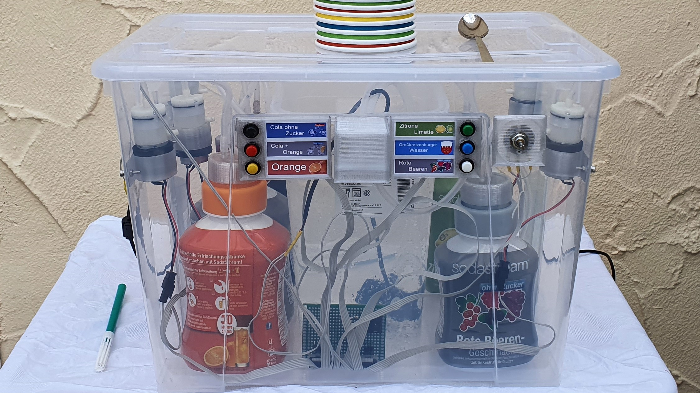 

SodaMat is a self-built beverage mixing machine, which consists of 3D printed parts as well as easily available components.

The aim of the project is to build a machine that prepares the desired amount of a ready-mixed drink in the right proportion of bubbled water and syrup at the push of a button.

We place our design of the vending machine under open source and describe the structure here, so that anyone can rebuild it for non-commercial purposes free of charge. 

## Videos

Circuit

In this video I show briefly how the circuit works on a breadboard.

https://youtu.be/glGSpBsMzlo

After installing the electrical components

This video shows an intermediate stage in the construction of the beverage vending machine, when the electrical components such as pumps, buttons and the potentiometer have already been completely installed in the housing.

https://youtu.be/BnMTtF5-dhc

First function test with real syrup

This video shows the first functional test of the machine after installation and connection of all components.

https://youtu.be/NOZfXYWacTg

Translated with www.DeepL.com/Translator (free version)

## Features

- Has a 4.2 litre reservoir for pure, bubbled water
- Offers sufficient space for the connection of up to 6 different Sodastream syrup containers
- Mixing ratio variably adjustable by speed control of the syrup pumps via potentiometer
- Easy to reproduce, as only 3D printed parts and readily available, inexpensive purchased parts were used 
  - Ikea Samla box as housing
  - Ikea 365+ container for water supply
  - Micro air pumps as syrup air pressure pumps
  - Aquarium pump as water pump
  - Silicone hoses
- Good hygiene / food compatibility
  - All food contact parts are certified Food safe
  - Syrup does not come into contact with the pump, as the pump only produces compressed air and thus displaces the syrup out of the container via an ascending pipe
  - Easy to clean, removable water tank, all food contact components can be rinsed with soapy water
- Easy to transport, all components find room in the box
- Expandable and easily modified platform
  - Modular design allows exchange of individual components e.g. 
  - Replacement of the air pressure pumps by peristaltic pumps possible
  - Replacement of the analog speed control by PMW via microcontroller possible
  - load cells / level sensors / flow sensors can be retrofitted

## Required parts

- 1x Ikea Samla Box with lid 22 litre as cabinet
  - https://www.ikea.com/de/de/p/samla-box-mit-deckel-transparent-s79850875/
- 1x Ikea 365+ storage container with lid 4.2 litres as water reservoir (lid is optional, but makes transport easier)
  - https://www.ikea.com/de/de/p/ikea-365-vorratsbehaelter-mit-deckel-rechteckig-kunststoff-s59276822/
- 1x DC power supply 9 Volt or 12 Volt at least 1500 mA
- 1x aquarium submersible pump as water pump with at least 240 L/h flow rate
  - https://www.amazon.de/gp/product/B07R8SLQS7
- 6x Mini air pumps 6 Volt as syrup Air pumps
  - https://www.amazon.de/gp/product/B07BY4LP22
  - https://de.aliexpress.com/item/32852470081.html
- 6x push buttons for the control panel
  - https://de.aliexpress.com/item/4000164264475.html
- 1 meter silicone hose 7 x 10 mm for water pump 
  - https://www.amazon.de/gp/product/B06XW5NYZ1
- 5 meter silicone hose 3 x 5 mm as air pressure hose and as riser for syrup
  - https://www.amazon.de/gp/product/B01N2GW7PX
- 1x N-Channel Mosfet for example Infineon IRF740PBF or Infineon IRFP064N or Infineon IRFP1405PBF
  - https://de.aliexpress.com/item/32907153234.html
- 1x potentiometer 4,7 kOhm 
  - https://www.amazon.de/gp/product/B07M5MB2M5
- 6x diode 1 ampere for example 1N4007
  - https://www.amazon.de/gp/product/B07JGRXJQ5
- 1x breadboard
  - https://www.amazon.de/gp/product/B078HV79XX
- 16x cheese head screws M3 x 10 mm and nuts (optionally with washers)
- Optional grub screw M5 for clamping the potentiometer cap
- 4x M3 x 10 mm hexagon socket head screws and nuts (optionally with washers) for control panel with beverage labels
- Optional JST plug + crimping tool for making plug connections for the pumps
  - https://www.amazon.de/gp/product/B0716WZ6RW
- Optional 40 pin IDE header + IDE ribbon cable as connection cable of all electrical components to the board
  - https://www.amazon.de/gp/product/B007Q92OK2
  - https://www.amazon.de/gp/product/B00Z5AVRDY
  - But such a thing can also be cannibalized from an old PC mainboard
- Optional stranded cable 0.5 mm² (if you decide against the IDE flat cable)
- 1x roll of 3D printer filament made of certified food safe material, recommendation BASF Ultrafuse EPR InnoPET in transparent
  - https://www.igo3d.com/innofil3d-epr-pet
- 6x closing caps of sodastream syrup bottles
- Adhesive for bonding plastic parts
- Heat shrinkable tubing
- Solder
- Hot glue sticks
- Cable ties

## Tools

- 3D Printer
- soldering iron
- Hot glue gun
- Multimeter
- Optional breadboard / plug-in board + connecting cable to test the circuit before soldering it
- Cutter Knives
- Pliers (wire stripper, beak pliers)
- Optional crimping pliers for JST connectors
  - https://www.amazon.de/gp/product/B01N4L8QMW
- Tweezers
- Screwdriver / Wrench
- Felt-tip pen for marking on plastic
- Folding rule
- Bolt circle drill with 24 mm diameter
- Drill 3.5 mm and 10 mm
- Handsaw with fine toothing (suitable for plastics)
- Files / Sandpaper

## Electrical circuit

### Structure of the circuit on the plug-in board / breadboard

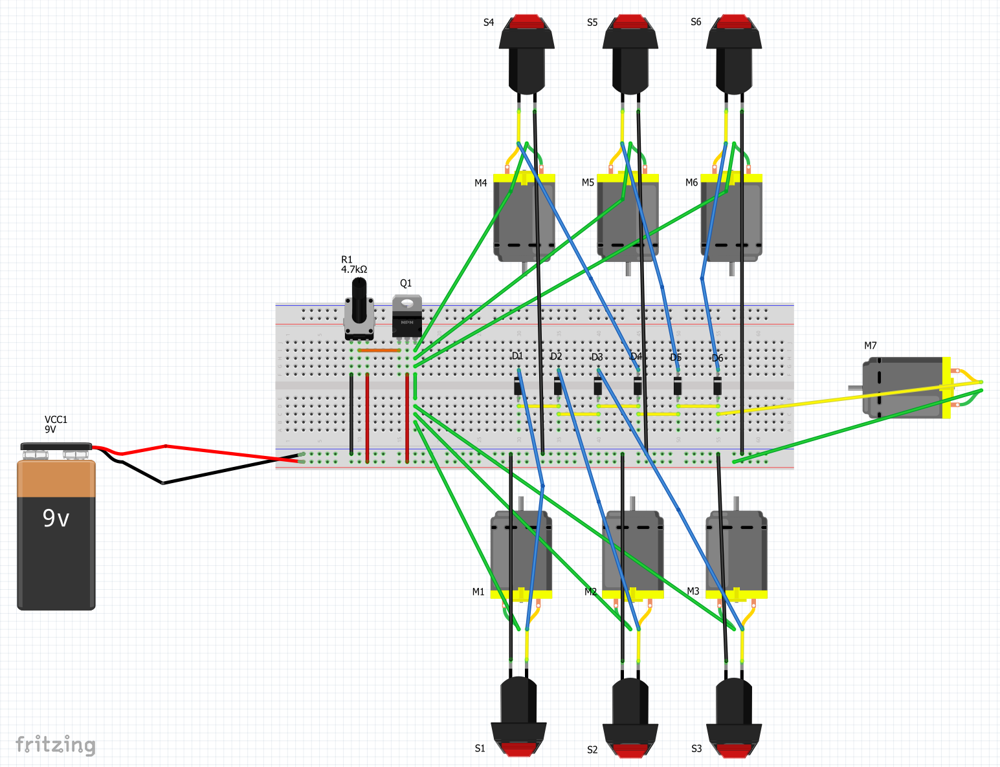 

### Schematic

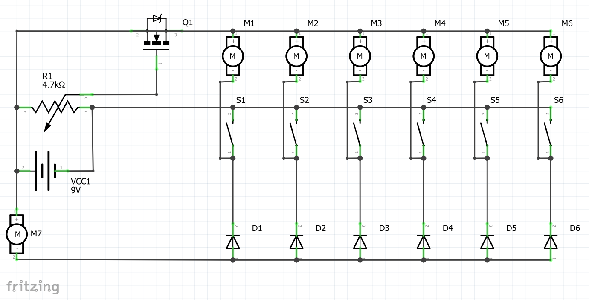 

### Parts list

No. | Quantity | Designation  
------ | ------ | -------------
M1 - M6 | 6 | Mini air pumps 6 Volt
S1 - S6 | 6 | Push buttons
D1 - D6 | 6 | diode 1 ampere 1N4007
M7 | 1 | aquarium submersible pump with at least 240 L/h flow rate
R1 | 1 | potentiometer 4,7 kOhm
Q1 | 1 | N-Channel Mosfet for example Infineon IRF740PBF or Infineon IRFP064N or Infineon IRFP1405PBF
VCC1 | 1 | DC power supply 9 Volt or 12 Volt at least 1500 mA

### Implementation

Optionally, the circuit can first be assembled on a breadboard for test purposes (see assembly sketch above). For simplification, you can also test with only two syrup pumps, for example, simply omit M3-6, S3-6 and D3-6.

Then all components have to be soldered on a breadboard as shown in the schematic. The board will later be placed in the middle of the housing between the front of the housing and the water tank, so please remember the cable lengths.

Optionally the free standing components, which are not soldered directly on the board, can be connected to the board via a 40 pin IDE header + ribbon cable pluggable to the board. This concerns 

- the pumps M1 - M6 and M7
- the buttons S1 - S6
- the potentiometer R1
- the power source / power supply unit VCC1 

To do this, simply solder the 40 pin IDE header onto the board and think up and note down an assignment. I have chosen the pins with regard to a strategically clever caleb path (without wild crossings) as follows:

- Pin 1 - 6 for the pumps M1 - M3 on the left side of the housing
- Pin 7 - 12 for the buttons S1 - S3 on the left side of the housing
- Pin 26 - 28 for potentiometer R1 on the right side of the housing
- Pin 29 - 30 for the power source / power supply VCC1
- Pin 31 - 32 for the water pump M7 in the middle of the housing
- Pin 29 - 34 for the buttons S4 - S6 on the right side of the housing
- Pin 35 - 40 for the pumps M4 - M6 on the right side of the housing

Otherwise (if you decide against using an IDE header) the electrical connections must be made using stranded wire.

All soldered connections to cables and contacts of free-standing components must be insulated from short circuits with heat-shrinkable tubing.

As an option, JST plugs and sockets can be crimped to the cables on the side of the pumps in order to be able to quickly replace a pump in the event of a defect, for example.

Finally, place the board at its destination (middle of the housing between the front of the housing and the water tank) and arrange loose cables with cable ties.

## 3D Printing

### Material

Since the syrup comes into contact with a printed part, a certified food grade material should be used for 3D printing.
For this purpose I used the filament BASF Ultrafuse EPR InnoPET in Transparent, it is food safe, matches the color of the transparent housing of the vending machine well and also fulfills the required properties regarding stability, stretch elasticity and tightness.

### Printing parts

The following parts are to be printed in the number of pieces indicated:

- [01_Getränkedüse_mit_6_Schlauchdurchführungen](stl/01_Getränkedüse_mit_6_Schlauchdurchführungen.stl)
  - The central nozzle at the front of the housing, from which the water and syrup emerges and falls into the glass
- [02_6x_Pumpenhalterung](stl/02_6x_Pumpenhalterung.stl)
  - Bracket for mounting the compressed air pumps on the side walls of the Ikea Samla box
- [03_6x_Sirupschlauchadapter](stl/03_6x_Sirupschlauchadapter.stl)
  - Adapter with 2 hose connections, which are glued to the lids of the Sodastream Syrup bottles, please note special printing instructions below
- [04_2x_Tastergehäuse_Frontplatte](stl/04_2x_Tastergehäuse_Frontplatte.stl)
  - front cover of the control panel for 3 buttons, clamps the beverage label
- [05_2x_Tastergehäuse_Montagerahmen](stl/05_2x_Tastergehäuse_Montagerahmen.stl)
  - Rear part of the control panel for 3 buttons, here the beverage label is inserted and the front cover is clipped on
- [06_Potentiometergehäuse_Frontplatte](stl/06_Potentiometergehäuse_Frontplatte.stl)
  - Front cover of the potentiometer control panel, clamps the label with the scale for mixing ratio adjustment
- [07_Potentiometergehäuse_Montagerahmen](stl/07_Potentiometergehäuse_Montagerahmen.stl)
  - Rear part of the control panel of the potentiometer, here the label with the scale for the mixing ratio adjustment is inserted and the front cover is clipped on
- [08_Potentiometer_Drehknopf](stl/08_Potentiometer_Drehknopf.stl)
  - Rotating cap for the axis of the potentiometer, is clamped with a grub screw
- [09_Ikea_365+_Unterstellrahmen](stl/09_Ikea_365+_Unterstellrahmen.stl)
  - Optional: Frame for the Ikea 365+ water reservoir, can be glued to the bottom of the Ikea Samla box and marks a fixed position for inserting the container 
- [10_Soda_Mat_Label](stl/10_Soda_Mat_Label.stl)
  - Optional: SodaMat label to embellish / brand the Ikea Samla crate from the outside, can be stuck on the free strip over the control panel
- [11_Soda_Mat_Schablone](stl/11_Soda_Mat_Schablone.stl)
  - Optional: Template for easier sticking and placing of the letters of the SodaMat label

## Special pressure instructions for the syrup hose adapters

The syrup tube adapters are a bit difficult to print, so here are some tips:

The adapters must be as airtight as possible at the end of printing to maintain the air pressure generated by the pumps. In addition to this, there is the challenge of printing the roof of the lid as an overhang.

In order to avoid leakages and to get the overhang printed cleanly, the following pressure settings should be selected if possible: 

- Place the component so that the round surface of the lid and the inner hose connection flange are in contact with the pressure plate
- a high flow for example 110 % (must be tested beforehand to ensure that there is not too much overextrusion)
- wide lines for example 0.6 mm with a 0.4 mm nozzle (the wider the lines, the less space between them)
- The ideal temperature for BASF Ultrafuse EPR InnoPET was 220 degrees / 70 degrees in my heating bed
- Use as much cooling as possible to get a bridging at the overhang
- Do not use support structures / supports, otherwise it will be almost impossible to separate the support from the component non-destructively at the end, as the inner hose connection flange would be very close to the support
- Be sure to activate the bridge / bridging settings so that the first two bridge walls are printed with reduced flow and higher line spacing (see following picture)

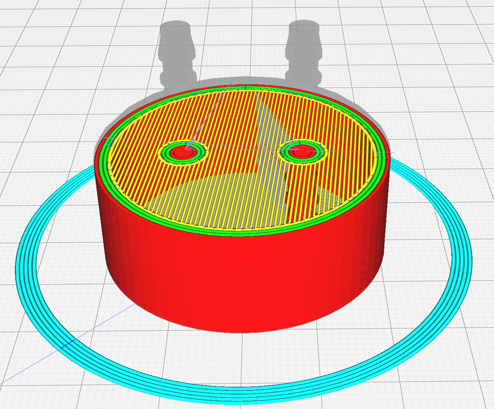 

## Assembly

### Assembly of the part __01_Getränkedüse_mit_6_Schlauchdurchführungen__

- On the front just below the upper rebate, mark the centre of the housing with the pen
- At the center point on the outside of the housing, stop part __01_Getränkedüse_mit_6_Schlauchdurchführungen__ so that the upper edge is flush with the upper fold of the housing
- On the inside of the housing, mark the centre of the 6 hose feed-through holes
- Also mark the 4 lateral holes for screw fixing 
- Drill through the housing at the marked central point with the 24 mm bolt circle drill for the 6 hoses
- Drill through the housing at the marked 4 lateral points with the 3.5 mm drill bit
- 6 cut off pieces of silicone tube 3 x 5 mm, about 40 cm long
- The hose end of the 6 silicone hoses 3 x 5 mm as well as the silicone hose 7 x 10 mm must first be threaded through one of the rear holes and then through the corresponding lower hole of the part __01_Getränkedüse_mit_6_Schlauchdurchführungen__, for this purpose pointed beak pliers or tweezers are helpful
- Align all hose ends so that they protrude just below the lower holes
- Fix the hose ends with hot glue so that they cannot slip out easily
- Push the rear part of the hoses from the outside through the drilled 24 mm hole of the Samla box
- Press __01_Getränkedüse_mit_6_Schlauchdurchführungen__ onto the housing and mount with 4 M3 x 10 mm cylinder screws + nuts

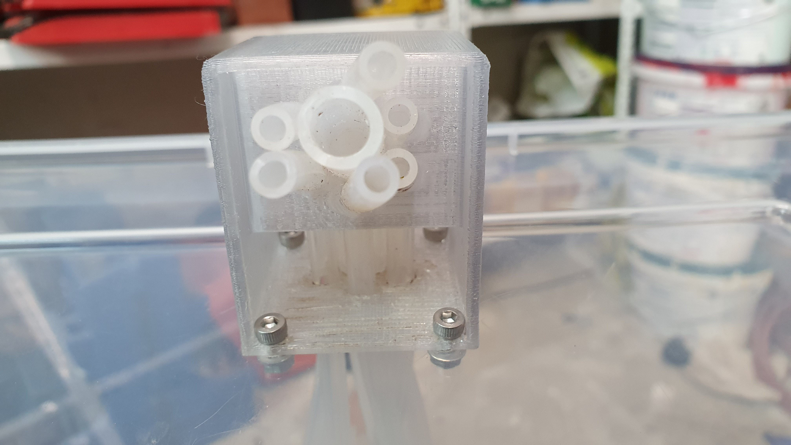 
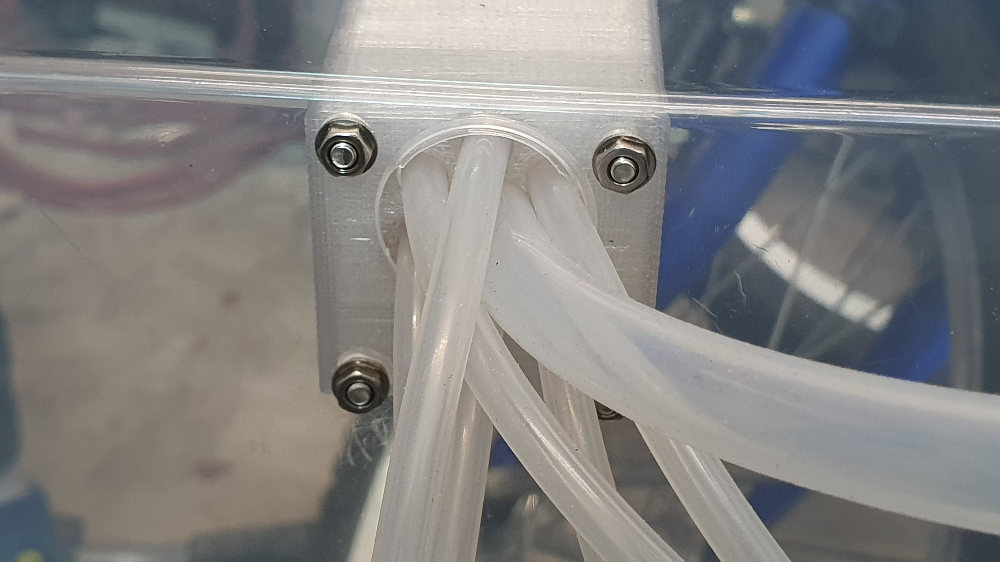 

### Assembly of the parts __02_6x_Pumpenhalterung__

- Insert a pump into a __02_6x_Pumpenhalterung__, glue a little bit of moss-rubber to the plastic part of the pump for noise decoupling and for better clamping (hot glue)
- Stop the __02_6x_Pumpenhalterung__ from the inside at one of the side walls of the Ikea Samla box and measure that it is placed vertically in the middle, the distance from the top should be chosen so that the lid of the Samla box can still be closed without hitting the pump
- Press the tabs of the holder firmly against the housing and mark the drill holes with the pen
- Determine and measure a fixed distance of the front and rear pump to the centre point, for this purpose mark the boreholes by stopping the bracket + pump analogous to the previous description
- Drill through the housing at the marked points with the 3.5 mm drill bit
- Proceed analogously on the other side of the housing
- Mount __02_6x_Pumpenhalterung__ with the pumps used and 2 M3 x 10 mm cylinder head screws on the inside of the housing sides

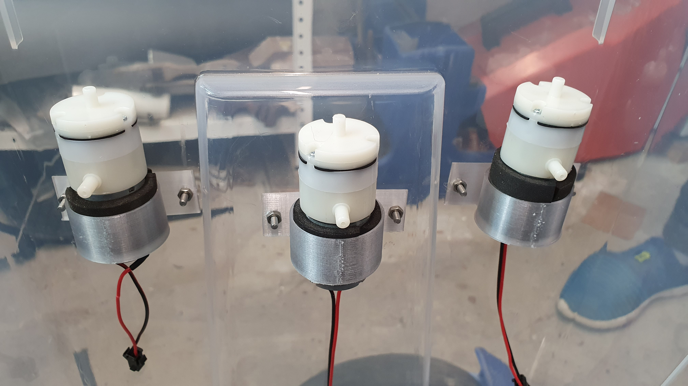 

### Assembly of the parts __03_6x_Sirupschlauchadapter__

- 6 Cut off pieces of the silicone tube 3 x 5 mm long (length corresponding to the height of the Sodastream syrup bottles)
- Attach one end of the hose to the inner hose connection flanges of the parts __03_6x_Sirupschlauchadapter__.
- Clean the caps of the sodastream syrup bottles and saw off the top surface / roofs and deburr with a file or sandpaper
- Apply plenty of plastic adhesive to the inside of the flanks of the parts __03_6x_Sirupschlauchadapter__ and place it on the sawn-off closing caps so that the parts are airtightly glued to the closing caps
- After the glue has dried, attach the 6 hose ends of part __03_6x_Sirupschlauchadapter__ to the hose connection flange under which the inner hose connection flange is also located (syrup riser)
- 6 cut off pieces of silicone tube 3 x 5 mm, about 20 cm long
- Put one end of the hose on the outlet (top) of the corresponding air pump, the other end on the remaining hose connection bottle of the parts __03_6x_Sirupschlauchadapter__

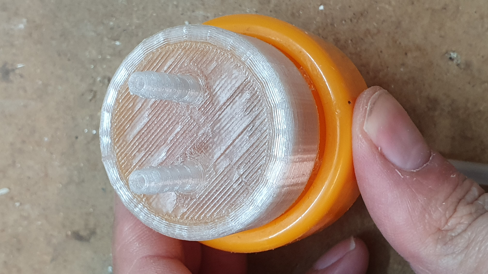 
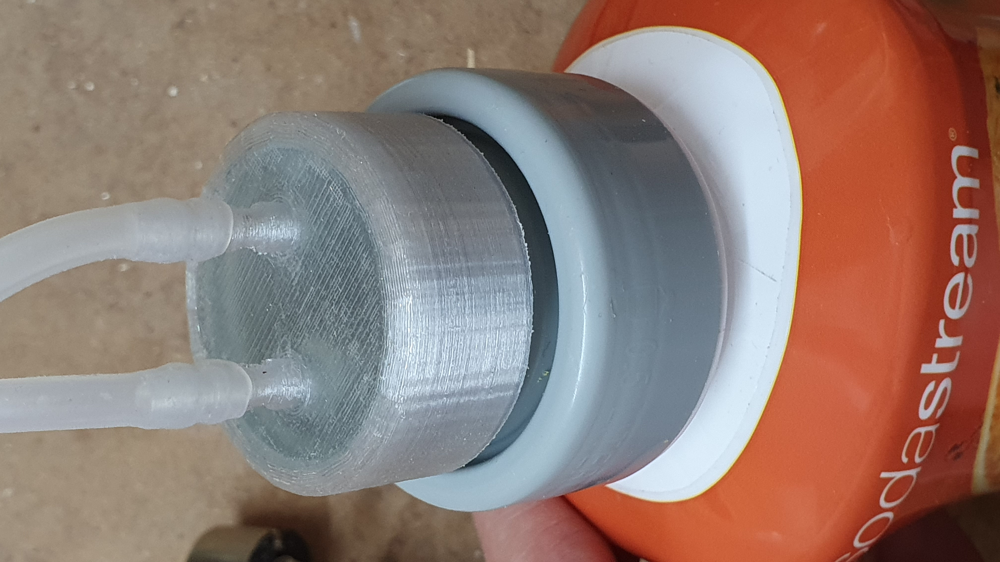 

### Assembly of the parts __04_2x_Tastergehäuse_Frontplatte__ and __05_2x_Tastergehäuse_Montagerahmen__

- Clip the two parts together and hold them to the front of the case (Ikea Samla box) so that the top is flush with the top rebate of the case and the inside is flush with part __01_beverage nozzle_with_6_tube feedthroughs
- Mark the 2 holes for screw fixing and the 3 holes of the buttons on the housing
- Drill through the housing at the 2 marked screw fixing points with the 3.5 mm drill bit
- Drill through the housing at the 3 marked points of the probe with the 10 mm drill bit
- 3 Insert the button through the holes in __05_2x_Tastergehäuse_Montagerahmen__ and through the drilled holes in the housing and tighten with the union nut on the inside of the housing
- Mount the __05_2x_Tastergehäuse_Montagerahmen__ on the front of the housing with 2 M3 x 10 mm countersunk screws
- Print out beverage labels, cut them to size and insert them into __05_2x_button housing_mounting frame
- Clip on __04_2x_Tastergehäuse_Frontplatte__
- Proceed in the same way with the pushbutton control panel on the other side of the housing

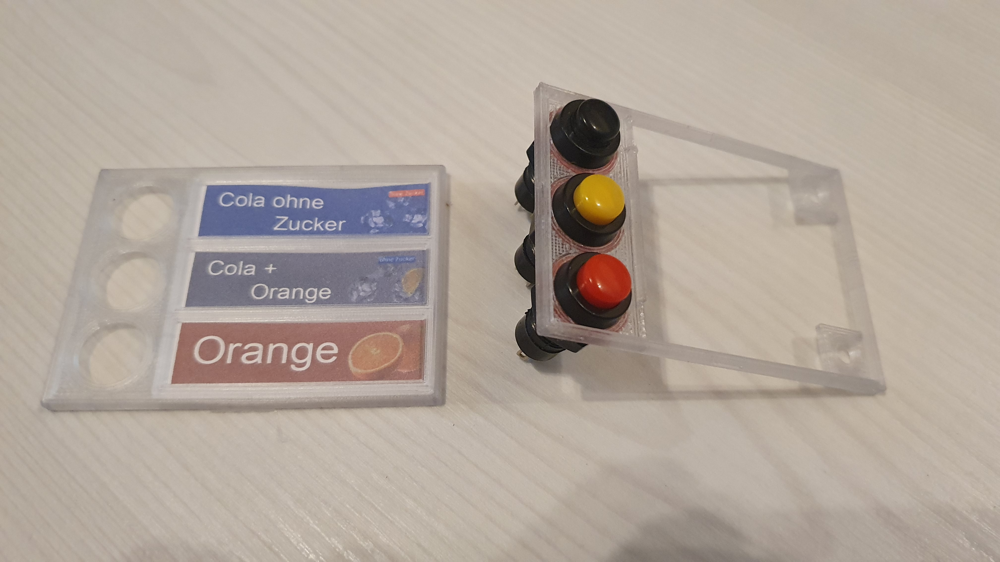 
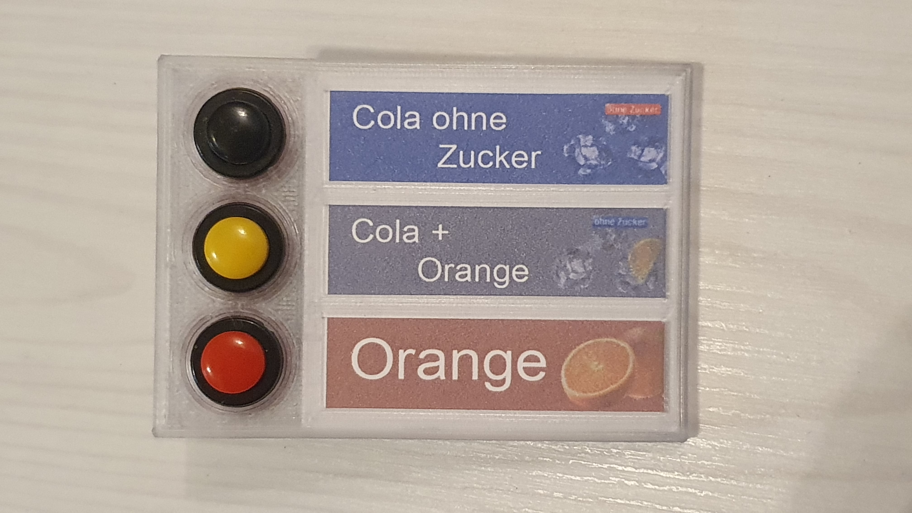 

### Assembly of the parts __06_Potentiometergehäuse_Frontplatte__ and __07_Potentiometergehäuse_Montagerahmen__

- When mounting these parts, proceed analogously to the mounting of __04_2x_Tastergehäuse_Frontplatte__ and __05_2x_Tastergehäuse_Montagerahmen__.
- The placement should be to the right of the right diagonal fold of the Ikea Samla box, top edge should be flush with the rest of the control panels horizontal distance can be chosen freely

### Assembly of the part __09_Ikea_365+_Unterstellrahmen__

- Place the part loosely on the floor without glue, place the Ikea 365+ container on top of it and align it in the Samla box so that it is horizontally in the middle and vertically hits the rear edge of the case
- Carefully remove the Ikea 365+ container and mark the position of the part at the bottom of the box without slipping
- Apply glue to the bottom of the part and fix the part at the marked position on the inside of the bottom of the box

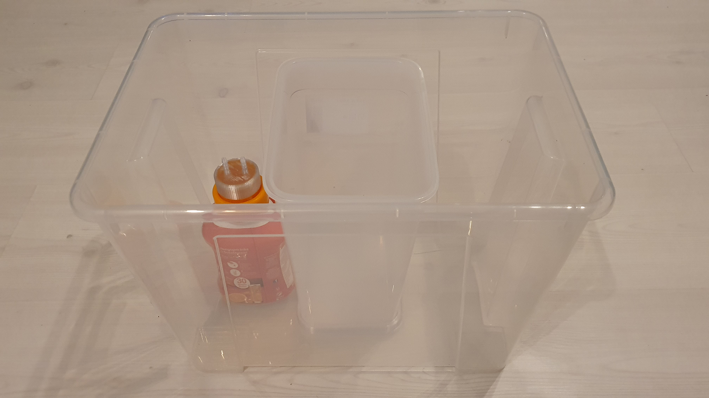 
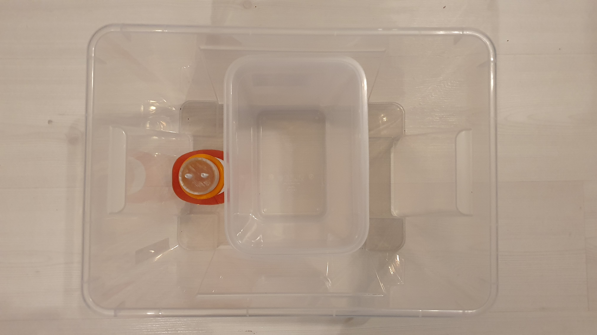 

### Mounting the water pump

- As it is a submersible pump, it is simply placed submerged in the Ikea 365+ water tank for operation
- To assemble, simply push the remaining hose end of part __01_Getränkedüse_mit_6_Schlauchdurchführungen__ onto the outlet of the pump

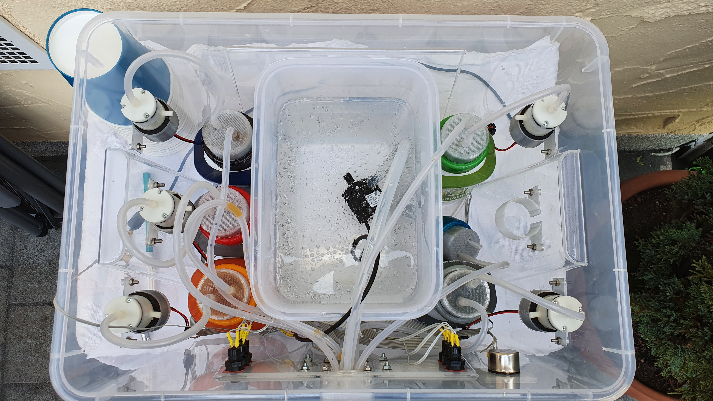 

